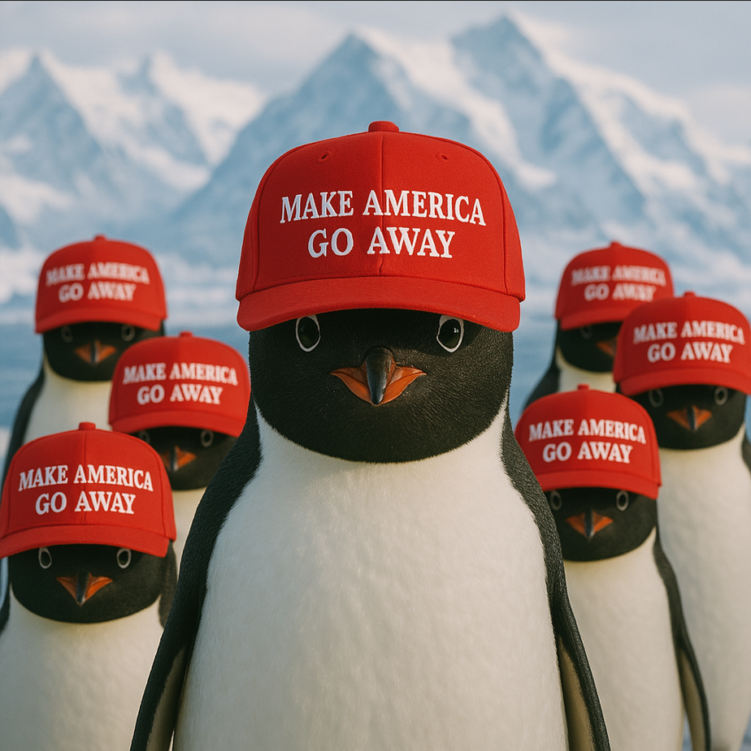

# 🌍 当特朗普向企鹅🐧征税：霸权的黄昏与中国的觉醒

## 🛡️ 关税之链：特朗普的“皇帝新衣”与企鹅🐧的抗议

特朗普所谓的“对等关税”，不过是霸权主义者最后的遮羞布。他大笔一挥，将企鹅🐧栖息的赫德岛与麦克唐纳群岛纳入征税范围，仿佛这些不会说话的生灵也是“贸易逆差”的共谋。这种荒诞行径，恰似《皇帝的新衣》中裸身巡游的帝王——自以为掌控全局，实则暴露了帝国黄昏的穷途末路。  

其动机卑劣如鼠🐭：对内，以“美国优先”的口号掩盖经济疲软的疮痍，转移民众对贫富分化的怒火；对外，妄图用关税锁链捆住全球产业链，却不知这锁链早已锈迹斑斑。他以为加征关税是“锁喉绝技”，却不料首先勒紧的是美国企业的咽喉——越南纺织业因46%的关税濒临破产，而美国消费者将为一件T恤多付30%的血汗钱💰。更讽刺的是，连企鹅🐧都学会了戴着“让美国走远点”的红帽抗议，可见这政策已沦为全球笑柄。  

  

## 🔥 破链之策：中国的“团结铁拳👊”与创新利刃⚔️  

### 1. 🏦 经济反击：以子之矛攻子之盾  
中国的反制如同外科手术般精准：对美34%的对等关税直击芯片💻、农产品🌾等要害，稀土出口管制更如“七寸之锁”让美国军工颤抖。海南自贸港零关税政策吸引全球资本💰，华为5.5G技术突破封锁，这些“去美国化”的布局，正是“教员”“独立自主”思想的当代回响。  

### 2. 🌍 外交破局：团结一切可团结的力量  
欧盟因20%关税怒而备战，东盟借RCEP深化合作🤝，连非洲最不发达国家都获中国98%税目零关税待遇。这恰如“教员”“三个世界”理论的鲜活实践——当特朗普将盟友逼成对手，中国正以“一带一路”编织新的全球网络。德国副总理哈贝克的“通胀日”论断，便是霸权孤立的最好注脚。  

### 3. 📣 舆论诛心：让“企鹅税🐧”成为霸权墓志铭  
中国媒体将特朗普的“企鹅税🐧”制成表情包，揭露其“连南极冰块都要征税”的贪婪。这种“以彼之道还施彼身”的舆论战，比鲁迅笔下的“落水狗”更犀利——当全球网民将企鹅抗税的梗图刷爆白宫账号，美国的“规则霸权”便在笑声中瓦解。  

## 🏛️ 必战之由：历史的回响与民族的尊严  

### 1. 🚫 弱国无外交，妥协即灭亡  
百年前的“二十一条”谈判，蒋介石的退让换来的是东北沦陷；今日若对特朗普妥协，明日新疆棉、华为5G都将成为案板鱼肉。正如“教员”在抗美援朝时所言：“打得一拳开，免得百拳来”，中国若此刻沉默，南海仲裁、台湾问题都将成为新的“庚子赔款”。  

### 2. 🇨🇳 民族尊严不容践踏  
特朗普将关税大棒挥向企鹅🐧，本质是对国际规则的公然践踏。这让我想起鲁迅《中国人失掉自信力了吗》的呐喊——当“自欺力”笼罩美国政坛，中国正以“自主创新”重塑全球产业链，用“嫦娥探月🚀”“天问火星火星”证明：真正的自信，不在关税的虚张声势，而在科技的脚踏实地。  

### 3. 🔄 全球秩序的重构时刻  
当美国用关税制造分裂，中国正以《区域全面经济伙伴关系协定》（RCEP）书写合作新篇。这种“团结一切可以团结的人”的智慧，比特朗普的“美国优先”更具生命力——毕竟，历史终将证明，用关税砌墙的人，只会困死在自己的牢笼里。  

## 🌪️ 结语：东风压倒西风  

特朗普的关税闹剧，恰似鲁迅笔下的“阿Q”——在臆想的胜利中走向灭亡。而中国的应对，正如“教员”所言：“战略上藐视敌人，战术上重视敌人”。当我们以对等关税反击霸凌，以科技创新突破封锁，以全球合作重构秩序，这不仅是对霸权的回应，更是对民族复兴的庄严承诺。  

历史的车轮滚滚向前，那些妄图用关税阻挡潮流的人，终将被碾成齑粉。而中国，正以“不管风吹浪打，胜似闲庭信步”的从容，在时代的浪潮中书写新的传奇。